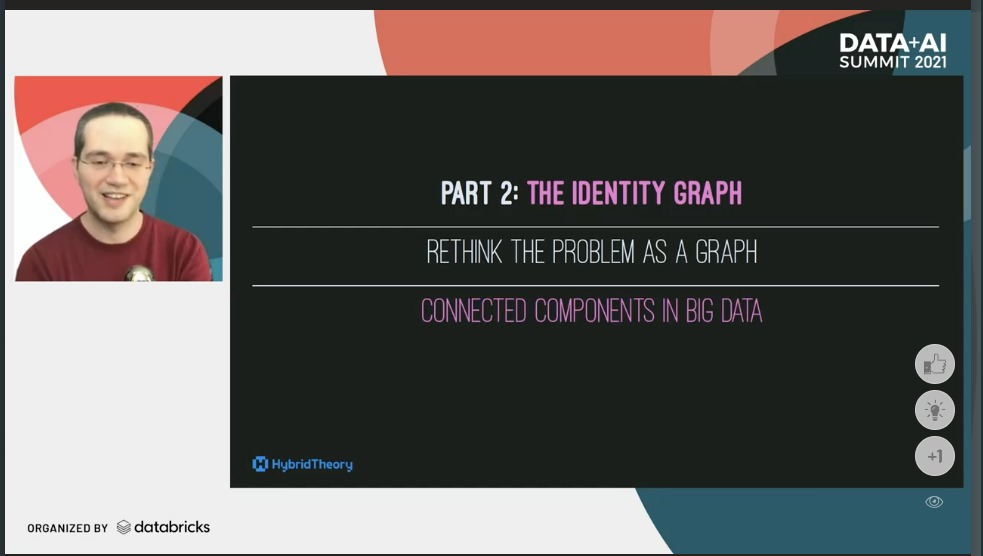

# Keeping identity graphs in sync with Apache Spark

Presentation I ([@berenguel](https://twitter.com/berenguel)) gave at the [Data Love Conference](https://datalove.konfy.care) on April 2021
and May at the [Data+AI Summit](https://databricks.com/session_na21/keeping-identity-graphs-in-sync-with-apache-spark) to explain how we manage a 2 billion node graph at [Hybrid Theory](https://www.hybridtheory.com). You can find the slides
[here](https://github.com/rberenguel/identity-graphs/releases/download/0.2.0/identity-graphs.pdf)
(some images might look slightly blurry). I recommend you check the version with
[presenter
notes](https://github.com/rberenguel/identity-graphs/releases/download/0.2.0/identity-graphs-with-notes.pdf)
which is only available here. You can also head over the _releases_ tab in case I have a more recent version and forgot to update this README.

If you want additional information about Spark in general, I gave an
`introduction to Spark` talk with [Carlos Peña](http://twitter.com/crafty_coder)
that you can find [here](https://github.com/rberenguel/WelcomeToApacheSpark).

---

The video from Data Love is available [here](https://www.youtube.com/watch?v=xL8uFgXLEQY&list=PLBqWQH1MiwBS8f0PhhDeQuBVCjxC_i0X5&index=23). Don't miss the whole [playlist](https://www.youtube.com/playlist?list=PLBqWQH1MiwBS8f0PhhDeQuBVCjxC_i0X5) of videos of the conference.

You can watch the recording from Data+AI Summit by registering to it and selecting "On Demand" [here](https://databricks.com/session_na21/keeping-identity-graphs-in-sync-with-apache-spark).

---

This presentation is formatted in Markdown and prepared to be used with
[Deckset](https://www.decksetapp.com/). The drawings were done on an iPad Mini 5
using [Procreate](https://procreate.art).

---

### Live at [Data+AI Summit](https://databricks.com/session_na21/keeping-identity-graphs-in-sync-with-apache-spark) (2021, May)

  </img>

### Live at [Data Love ❤️](https://datalove.konfy.care) (2021, April)

  </img>

---

---

